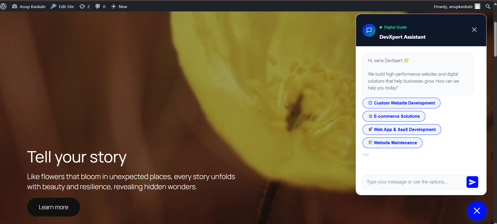

# DevXpert Digital Project Assistant
A high-performance, AI-powered chatbot designed specifically for **Web Development Agencies**. This plugin transforms your WordPress site into an interactive sales and support hub, using Claude AI to guide clients through your service offerings and capture high-quality leads.

## About the Plugin
The **DevXpert Digital Project Assistant** is more than just a chat widget; it's a specialized project strategist for your agency. It handles the initial heavy lifting of client qualification—answering technical questions about your tech stack, explaining your development process, and collecting detailed project briefs—allowing your team to focus on delivery.

Built with a modern **Navy, Blue, and Teal** aesthetic, the UI is designed to feel as high-end as the digital products you build.

## Key Features
- ** RAG-Powered AI (Claude):** Uses Retrieval-Augmented Generation to answer visitor questions based specifically on *your* website's content. No generic answers—only accurate information about your agency.
- **Lead Capture Pipeline:** A structured "Consultation Flow" that qualifies leads by industry, budget, platform (WordPress, React, Shopify), and project goals.
- **Audience Growth:** Integrated newsletter popup with customizable benefits and delayed triggers to build your email list.
- ** Modern Admin UI:** A fully redesigned administration suite that matches the frontend aesthetic, providing a professional workspace for managing leads and settings.
- ** Reliable Notifications:** Built-in SMTP configuration to ensure lead alerts and newsletter notifications always reach your inbox.
- **🎨Dynamic Branding:** Fully customizable accent colors and header text via the WordPress admin.

## Installation

### Via WordPress Admin
1. Download the plugin as a ZIP file.
2. Navigate to **Plugins > Add New** in your WordPress dashboard.
3. Click **Upload Plugin** and select the ZIP file.
4. Click **Install Now** and then **Activate**.

### Manual Installation
1. Upload the `chatbot` folder to your `/wp-content/plugins/` directory.
2. Activate the plugin through the **Plugins** menu in WordPress.
3. Navigate to **DevXpert Chatbot > Settings** to initialize your brand controls.

## Usage & Configuration
1. **Branding:** Set your Agency name and accent color in the main Settings page.
2. **Conversation Design:** Use the **Questions Editor** to customize the JSON flow for your specific service buttons and intake questions.
3. **AI Workspace:** Add your Claude API key and run the **Website Scraper** to build your agency's knowledge base.
4. **Leads:** Review and manage all captured project enquiries in the **Sales Pipeline** view.

---

